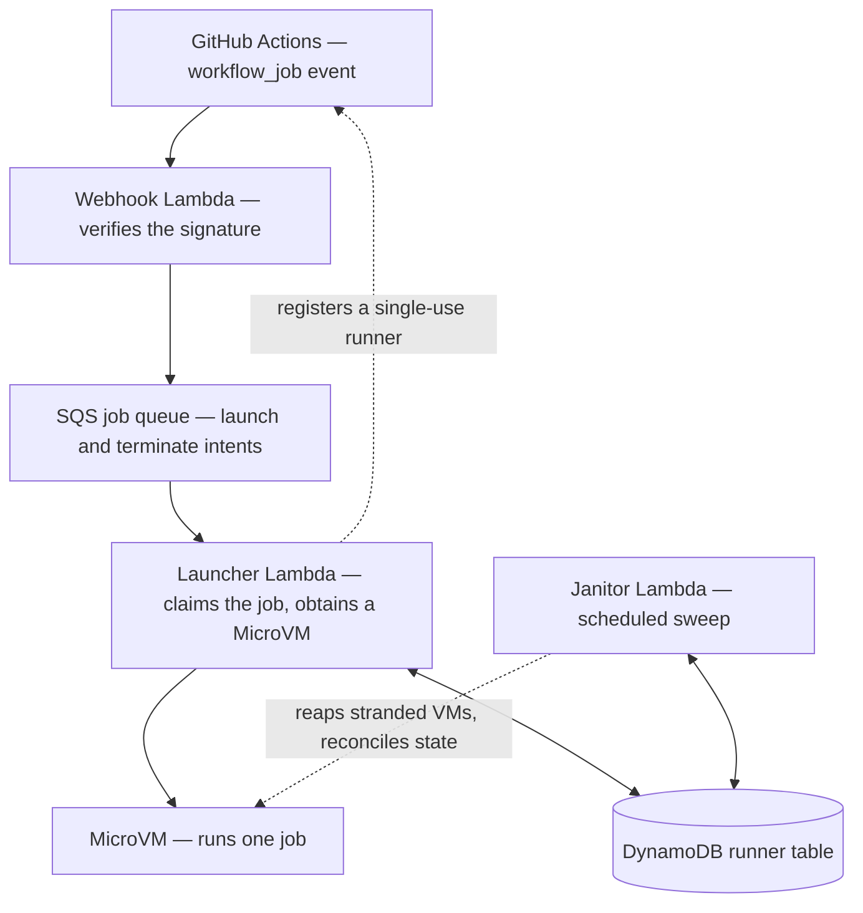

# cdk-github-microvm-runners

[](https://www.npmjs.com/package/cdk-github-microvm-runners) [](https://pypi.org/project/cdk-github-microvm-runners/) [](https://github.com/schuettc/cdk-github-microvm-runners/actions/workflows/ci.yml) [](LICENSE)

A CDK construct library that runs GitHub Actions jobs on
[AWS Lambda MicroVMs](https://docs.aws.amazon.com/lambda/latest/dg/lambda-microvms-guide.html).
Each job runs on its own MicroVM in your AWS account, created when the job
starts and removed once it finishes.

## Why this exists

AWS Lambda MicroVMs provides the ability to launch a MicroVM, but nothing that
connects one to GitHub Actions: there is no runner registration, no path from
an incoming job to a running VM, and no cleanup when a VM or a runner is left
behind. AWS CDK provides the individual building blocks — Lambda functions, a
queue, a table, IAM roles — but not an assembled system. This construct is that
system. It receives GitHub's `workflow_job` events, launches a MicroVM for each
job, registers a single-use runner, and reconciles the result afterward, so
that adopting per-job MicroVM runners is a matter of configuring a construct
rather than building and operating the surrounding machinery yourself.

Two design decisions shape the rest of the library. The runner VMs hold no AWS
credentials by default, because a MicroVM's instance metadata service would
otherwise return any attached role's credentials to the code running in the
job; a job that needs AWS obtains its own short-lived credentials through GitHub
OIDC instead. Routing is per job: a workflow job opts in by naming the runner's
label in its `runs-on`, and every other job continues to run on GitHub-hosted
runners, so a repository can be moved across one job at a time.

## How it works

A single runner set — one `GithubMicrovmRunners` in a stack — serves a GitHub
organization or a set of repositories. It is configured with two required
properties: how it authenticates to GitHub, and which organization or
repositories it serves.

A runner class pairs a `runs-on` label with the MicroVM size and image that
jobs carrying that label run on, and a runner set can define more than one.
Each class builds its own image and runs at its own size, so a workflow can
send small jobs to one class and memory-heavy jobs to a larger one by choosing
the matching label. The runner VMs are ARM64, so the tools and container images
a job pulls need arm64 builds.

<!-- sync:begin lifecycle-diagram -->



<!-- sync:end lifecycle-diagram -->

When GitHub sends a `workflow_job` event, the webhook handler verifies its
signature and places the job on an SQS queue. The launcher reads the queue,
records a claim so that a given job is only ever launched once, starts a
MicroVM (or resumes one from a warm pool, if the runner class keeps one), and
registers a single-use runner with GitHub. The VM runs that one job and is then
removed. A janitor runs on a schedule to reconcile the runner set against the
running VMs and GitHub's view of its runners, terminating anything that was
stranded and cleaning up records that are no longer needed. The
[architecture guide](docs/architecture.md) describes the lifecycle, the
idempotency model, and the checks that keep the janitor from terminating a
runner that is still working.

## Install

One source, compiled by jsii into two packages. The API is the same in each,
with names rendered in the target language's conventions.

```bash
npm install cdk-github-microvm-runners
```

```bash
pip install cdk-github-microvm-runners
```

## Getting started

To deploy, you need an AWS account, a GitHub App connected to the runner set,
and the App's private key and webhook secret stored in AWS Secrets Manager. The
[getting-started guide](docs/getting-started.md) walks through all three, and
includes a helper that performs the GitHub App setup for you.

The example below is TypeScript; [API.md](API.md) carries the same surface for
every language.

```ts nofixture
import { App, CfnOutput, Stack } from 'aws-cdk-lib';
import { Secret } from 'aws-cdk-lib/aws-secretsmanager';
import {
  GithubMicrovmRunners,
  GithubAppId,
  GithubAppKey,
  GithubAuth,
  RunnerScope,
  MicrovmSize,
} from 'cdk-github-microvm-runners';

const app = new App();
const stack = new Stack(app, 'Runners', { env: { region: 'us-east-1' } });

// The GitHub App's ID, private key, and webhook secret are read from Secrets
// Manager at run time, so this stack deploys before the App is created.
const appId = Secret.fromSecretNameV2(
  stack,
  'AppId',
  'microvm-runner/dev/app-id',
);
const privateKey = Secret.fromSecretNameV2(
  stack,
  'AppKey',
  'microvm-runner/dev/app-private-key',
);
const webhookSecret = Secret.fromSecretNameV2(
  stack,
  'WebhookSecret',
  'microvm-runner/dev/webhook-secret',
);

const runners = new GithubMicrovmRunners(stack, 'Runners', {
  github: GithubAuth.app({
    appId: GithubAppId.fromSecret(appId),
    privateKey: GithubAppKey.fromSecret(privateKey),
    webhookSecret,
  }),
  scope: RunnerScope.org('my-org'),
});

// A runner class pairs a label with the MicroVM size it runs on. Workflows
// reach it through `runs-on: [self-hosted, microvm]`.
runners.addRunnerClass('microvm', { size: MicrovmSize.GB4 });

new CfnOutput(stack, 'WebhookUrl', { value: runners.webhookUrl });
```

Once the stack is deployed, point the GitHub App's webhook at the stack's
`WebhookUrl` output — the setup helper reads it from the stack and wires it for
you, or you can set it by hand — and change a workflow job's `runs-on` to
`[self-hosted, microvm]`.

## Examples

The samples below extend the runner set above, and each shows only the part it
adds.

### A runner class with its own image

A runner class that names no image builds from the base image, which carries
the operating system, the Actions runner, Docker, and the AWS CLI.
`RunnerImage.fromOptions` describes what to add to that base: system packages,
setup commands, environment variables, and files.

```ts
runners.addRunnerClass('build', {
  size: MicrovmSize.GB8,
  image: RunnerImage.fromOptions({
    systemPackages: ['jq', 'ripgrep'],
    setupCommands: ['npm install -g pnpm@10'],
  }),
});
```

Images are built when the stack deploys, so a job that arrives later boots an
image that already exists. [Runner images](docs/images.md) covers the three
ways to describe one, including supplying a Dockerfile of your own.

### Language versions baked into the image

`actions/setup-python` and `actions/setup-node` resolve the version a job asks
for from the image's tool cache. A toolchain is a language runtime placed in
that cache when the image is built.

```ts
runners.addRunnerClass('test', {
  size: MicrovmSize.GB4,
  image: RunnerImage.fromOptions({
    toolchains: [
      RunnerToolchain.python('3.12.7'),
      RunnerToolchain.node('22.11.0'),
    ],
  }),
});
```

Each toolchain pins a full three-part version, because that version names the
cache directory it is baked into. A workflow targeting the class then writes
`actions/setup-python` as it would on a GitHub-hosted runner, and
[Toolchains](docs/toolchains.md) covers the rest.

### Runners in your own VPC

Network egress belongs to the runner set rather than to a class, and every
runner class shares it. `RunnerNetwork.vpc` has the construct build a Lambda
runtime connector from a VPC you pass, so the VMs follow that VPC's subnets,
security groups, and route tables.

```ts
new GithubMicrovmRunners(stack, 'Runners', {
  github,
  scope: RunnerScope.org('my-org'),
  network: RunnerNetwork.vpc(vpc, {
    subnets: { subnetType: ec2.SubnetType.PRIVATE_WITH_EGRESS },
  }),
});
```

The connector's network interfaces land in the VPC's private-with-egress
subnets and get a new security group unless you pass your own. The
[security guide](docs/security.md) covers attaching a connector you already
manage, and what the VPC's routing then decides for a job.

## Security

The runner VMs carry no AWS identity by default, so a compromised or malicious
workflow step has no credentials to read from the instance metadata service. A
job that needs AWS assumes a role scoped to that job through GitHub OIDC. The
[security guide](docs/security.md) covers the whole model, including the OIDC
trust-policy setup and the details that are easy to get wrong.

The webhook is served from a public Lambda Function URL, because GitHub cannot
sign its webhook deliveries with SigV4. The handler verifies GitHub's
HMAC-SHA256 signature on every request.

A single property attaches an execution role to the VMs — `vmExecutionRole` —
for a runner set whose jobs need a standing AWS identity. Because that role's
credentials become readable from inside the job, it is off by default, and the
construct never creates a VM identity on your behalf. Runtime console capture
(`consoleLogs: ConsoleLogs.enabled()`) writes its logs through that same role,
so it too requires `vmExecutionRole`, and you grant the role the log-write
actions yourself.

## Documentation

| Guide                                                                                        | What it covers                                                                                 |
| -------------------------------------------------------------------------------------------- | ---------------------------------------------------------------------------------------------- |
| [Getting started](docs/getting-started.md)                                                   | Prerequisites, GitHub App setup, deploying, and running a first job                            |
| [Onboarding a repo](docs/onboarding.md)                                                      | Moving an existing repository's CI onto the runners                                            |
| [Runner images](docs/images.md)                                                              | What an image contains, when it is built, how it changes, and the disk each size allows        |
| [Toolchains](docs/toolchains.md)                                                             | Baking the Python and Node versions your workflows use into the image                          |
| [Security](docs/security.md)                                                                 | The security model, per-job AWS access through GitHub OIDC, and the control plane              |
| [Service quotas](docs/service-quotas.md)                                                     | Sizing for concurrency, and what to do when a quota cannot be raised                           |
| [Monitoring](docs/monitoring.md)                                                             | Opt-in CloudWatch metrics and the ready-made alarms                                            |
| [Logging](docs/logging.md)                                                                   | Image build logs and runtime VM console output, and the tradeoff console capture involves      |
| [Architecture](docs/architecture.md)                                                         | The lifecycle, the idempotency model, and the checks that prevent terminating an active runner |
| [API reference](API.md)                                                                      | Every construct, property, and default, generated from the source                              |
| [Security policy](SECURITY.md) · [Contributing](CONTRIBUTING.md) · [Changelog](CHANGELOG.md) | Reporting and project information                                                              |

## Configuration

Beyond the two required properties, every option is optional and has a
conservative default, so the example above deploys as written. The available
options include a customer-managed KMS key applied to the
DynamoDB table, the SQS queues, and the log groups (`encryptionKey`); a
permissions boundary applied to every role the construct creates
(`permissionsBoundary`); the removal policy, DynamoDB point-in-time recovery,
log retention, dead-letter retention, dead-letter redrive count, and Lambda
memory; and control over the VMs' network egress through `RunnerNetwork`.

## Development

Quality checks run through [`just`](https://github.com/casey/just) and are
enforced by [lefthook](https://github.com/evilmartians/lefthook) git hooks; CI
runs the same `just verify`.

```bash
brew install just lefthook
pnpm install
lefthook install
just verify
```

<!-- sync:begin branch-model -->

Feature pull requests target `dev`, which is promoted to `main` by pull
request.

<!-- sync:end branch-model -->

See [CONTRIBUTING.md](CONTRIBUTING.md) for local setup and the full workflow.

## License

Released under the [Apache-2.0](LICENSE) license.
