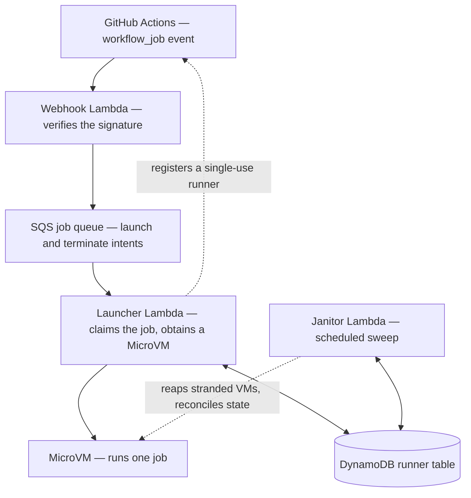

```mermaid
flowchart TD
    GH["GitHub Actions — workflow_job event"] --> WH["Webhook Lambda — verifies the signature"]
    WH --> Q["SQS job queue — launch and terminate intents"]
    Q --> LN["Launcher Lambda — claims the job, obtains a MicroVM"]
    LN --> VM["MicroVM — runs one job"]
    LN -.->|registers a single-use runner| GH
    LN <--> DB[("DynamoDB runner table")]
    JAN["Janitor Lambda — scheduled sweep"] -.->|reaps stranded VMs, reconciles state| VM
    JAN <--> DB
```
