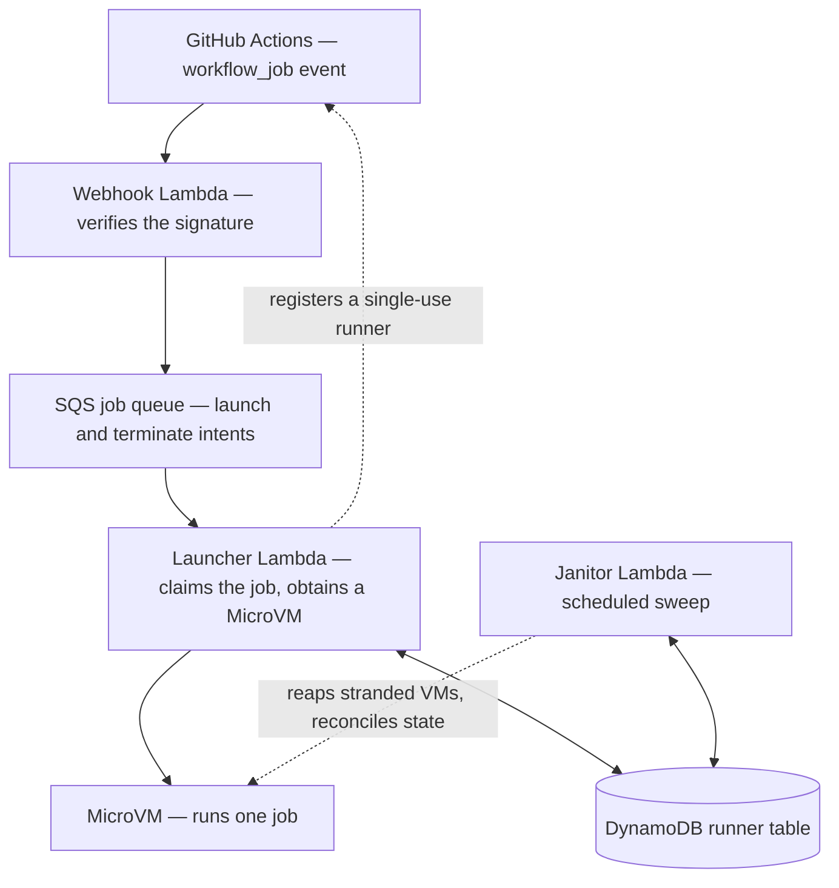

# Architecture

A runner set is one deployment of this construct. It is made up of a webhook
handler, an SQS job queue and its dead-letter queue, a launcher, a scheduled
janitor, a DynamoDB table, a warm-pool sweeper for any class that keeps one,
and one MicroVM image per runner class.

A runner class pairs a `runs-on` label with the MicroVM size and image contents
that jobs carrying that label run on, and a runner set can define several of
them. Each class builds its own image, because a VM's size is fixed by the
image at build time rather than chosen at launch. [Runner images](images.md)
covers what an image contains, when it is built, and the disk each size allows.

## The lifecycle

<!-- sync:begin lifecycle-diagram -->

<!-- sync:end lifecycle-diagram -->

1. The **webhook Lambda**, behind a public Function URL, verifies GitHub's
   HMAC-SHA256 signature against the raw request body before parsing it, using
   a timing-safe comparison, and answers a malformed payload with a 400. A
   `queued` `workflow_job` whose labels include one of the runner set's class
   labels becomes a `launch` intent on the job queue, and a `completed` event
   for a runner whose name carries the `microvm-runner` prefix becomes a
   `terminate` intent; anything else is acknowledged and ignored.

2. The **SQS job queue**, with its dead-letter queue, buffers that work and
   provides at-least-once delivery with partial-batch failure reporting, so a
   single failing message is redriven on its own.

3. The **launcher Lambda** handles a `launch` intent by first asking GitHub
   whether the job is still waiting for a runner, and dropping the launch if it
   is not. A job cancelled while it was still queued never produces a
   `terminate` intent — its `completed` event names no runner, because none
   ever claimed it — so without this check a VM would boot for a job that no
   longer exists and hold a concurrency slot until the janitor reclaimed it.
   The check fails open: anything short of a definite answer proceeds with the
   launch, because dropping a live job is far worse than booting a VM nobody
   needs. It then counts the runner set's running VMs and defers the message
   when the set is already at its concurrency cap, and claims the job with a
   conditional DynamoDB
   write keyed on `job#<repo>#<jobId>`, so that duplicate webhook deliveries,
   concurrent invocations, and same-batch duplicates all resolve to a single
   VM. Holding that claim, it registers a single-use runner with GitHub,
   obtains a VM — resuming a pre-booted warm-pool VM when the matched class
   keeps one, and otherwise cold-launching one with `RunMicrovm`, with no
   execution role attached by default — and pushes the runner's configuration
   to the VM's ingress endpoint. On the warm path the VM is resumed first and
   the runner registered against it; on the cold path the registration exists
   before the VM does, and the launcher releases it if the launch then fails.
   The runner-to-VM mapping row and the claim's VM id are written last and
   together, in a single transaction. If any step after the VM exists fails,
   the launcher terminates the VM and releases the claim once the VM is
   confirmed gone.

4. The launcher handles a `terminate` intent by looking up the runner's mapping
   row, terminating the VM that row names, and deleting the row. A `terminate`
   for a runner name the table does not know is a no-op.

5. The **MicroVM** runs exactly one job — GitHub's just-in-time runners are
   single-use. The runner deregisters itself from GitHub when the job ends, and
   the VM itself is terminated from outside, either by the `terminate` intent
   above or by the janitor.

6. The **janitor Lambda** runs on a schedule and reconciles the runner set. It
   terminates VMs that GitHub has lost track of or that never received a job,
   prunes old image versions, removes stale table rows, and re-launches jobs
   still queued that never got the runner they were promised. That last duty is
   the floor under the whole plane: GitHub announces a job once, so without it a
   launch that goes astray leaves the job waiting with no error anywhere. It is
   on unless you set `recoverStuckLaunches` to false.

A runner class that sets `warmPoolSize` adds a seventh piece: the **warm-pool
Lambda**, on its own schedule, which keeps that class's pool at its target by
pre-booting VMs and suspending them until a launch claims one.

## Start latency

A job waits from the moment GitHub queues it until a runner picks it up. On a
GitHub-hosted runner that is two or three seconds, because GitHub keeps machines
booted and already registered. Here it is the time to build a machine, and it is
worth knowing where it goes before trying to shorten it.

Measured on a bench runner, a cold `GB1` launch of a queued job:

| Segment                                  | Time     | What happens                                         |
| ---------------------------------------- | -------- | ---------------------------------------------------- |
| Queued → the VM is running               | 6.8 s    | webhook delivery, the queue, the launcher, VM boot   |
| VM running → the runner's first log line | 8.2 s    | `run.sh`, the .NET host starting, assemblies loading |
| Runner starting → connected to GitHub    | 9.0 s    | reading its configuration, registering               |
| Connected → the job begins               | 1.0 s    | GitHub assigns the queued job to it                  |
| **Total**                                | **25 s** |                                                      |

Three roughly equal thirds rather than one dominant cost. Queue latency is also
load-dependent: the same measurement ranges from about 25 s on a quiet set to
45 s with fifteen jobs launching at once.

**The last two segments are a floor.** A runner configured just-in-time has to
start and register for every job, because that is what makes it single-use — the
credential it registers with is minted for one job and is useless afterwards.
Roughly 17 seconds of the total is that property being enforced. A warm pool
removes the first segment, and nothing removes the other two.

That is the trade the design makes. GitHub's fleet is fast to start because its
machines are already registered and shared; a runner here is registered for your
job alone and destroyed after it. If start latency matters more than isolation
for a particular workflow, the honest answer is to leave that job on a
GitHub-hosted runner — the two fleets coexist in one workflow, and
[Onboarding](onboarding.md) covers routing jobs between them.

Start latency is also billed. A MicroVM starts charging when it reaches the
running state, which happens early in that chain, so a job pays for roughly
thirty seconds of a VM that has no job on it yet. That is a fixed cost per job
rather than a per-minute one, which is why short jobs cost proportionally more
here and long ones proportionally less.

## State: the runner table

The MicroVM service's VM list says which VMs a runner set is running, and a set
picks its own out of the account's list by image ARN: running MicroVMs cannot be
tagged, so each set names its images after itself —
`<runnerSetId><index>-<8 hex characters>`, hashed over the image's contents and
the packaged runner agent — and the launcher and janitor filter on those ARNs.

A single DynamoDB table, partitioned on `runnerName`, holds the rest of the
bookkeeping — which GitHub runner a given VM is serving, whether a job has
already been claimed, and how long a VM has looked stranded — in four kinds of
short-lived rows, distinguished by key prefix:

- `microvm-runner-…` maps a runner to its VM and carries the janitor's strike
  memory.
- `job#…` records a launch idempotency claim.
- `warmvm#…` records a warm-VM claim, resolved first-writer-wins.
- `orphan-vm-…` carries the janitor's strike memory for a VM that has no
  mapping row.

Rows expire through a TTL. The service's own VM list and GitHub's own runner
list are what actually exists, and the janitor re-reads both before it acts.

## Correctness guards

Three guards keep the launcher and the janitor acting on current information.

- A launch claim is created with a conditional write that succeeds only when no
  claim for that job exists yet. A claim whose attempt died mid-flight can be
  taken over once it is old enough, and that takeover — along with every later
  release or update of the claim — is keyed on a random `attemptToken`, so
  exactly one attempt's write succeeds. A warm-VM claim needs no such handoff:
  it is a single conditional write on `warmvm#<microvmId>`, and losing it means
  another launch reached that VM first. A committed launch writes its mapping
  row and stamps its claim in a single DynamoDB transaction.
- The janitor acts only on a fresh read. Immediately before it deregisters or
  terminates a registered runner it takes a per-runner read from GitHub and
  requires the runner to have been suspect since an earlier sweep. Whenever
  that fresh read contradicts the listing the suspicion was raised on — the
  runner is back, or it is `busy` — the strike memory is cleared and the runner
  is left alone. A running VM with no runner registration to read is instead
  guarded by a strongly consistent re-scan of the table taken the instant
  before termination, which aborts the kill if a mapping row has appeared in
  the meantime. Every one of these paths acts only on a `RUNNING` VM, so a warm
  `SUSPENDED` VM is listed by the sweep and left alone.
- Each janitor phase and each row is isolated, so a sweep completes and reports
  its counters — including `errors` — even when individual items fail. Those
  counters reach CloudWatch when `emitMetrics` is on; see
  [Monitoring](monitoring.md).
