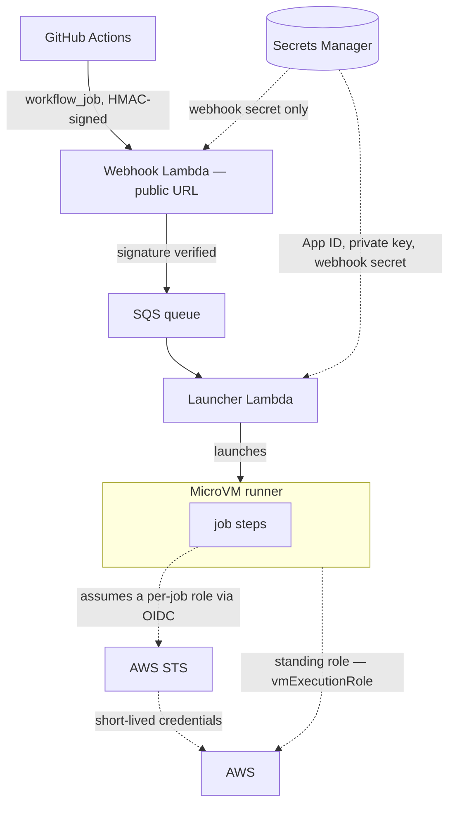

# Security



## Intake: the webhook

GitHub's webhook delivery arrives at a public Lambda Function URL
(`authType: NONE`), because GitHub cannot sign its deliveries with SigV4. The
handler verifies GitHub's HMAC-SHA256 signature over the raw request body with a
timing-safe comparison and rejects any request that does not match.

## Which repositories a runner set serves

A valid signature establishes that a delivery came from GitHub through your
App. It does not establish which repository the job belongs to, and those are
different questions: a GitHub App can be installed on more repositories, and
more organizations, than a given runner set is configured for, and every one
of those deliveries is correctly signed.

So `scope` is enforced, not descriptive. The webhook compares the delivery's
repository against it before anything reaches the queue, and the launcher
compares again before it calls GitHub, counts capacity, claims the job, or
starts a VM — a message arriving by any route other than that webhook is
checked too. Out-of-scope deliveries are ignored, and nothing is spent on
them.

`RunnerScope.org('acme')` serves every repository in that organization.
`RunnerScope.repos(['acme/api', 'acme/web'])` serves those two and nothing
else. Matching is case-insensitive, as GitHub is.

### Public repositories

A runner set serves the repositories you name, and anyone who can get a
workflow into one of those repositories can run code on its VMs. On a private
repository that is the people you have already trusted with commit access.

A **public** repository is different, and it is the standard caution about
self-hosted runners generally rather than anything specific to this construct.
A pull request from a fork runs the workflow file **as the fork wrote it**, so
someone who forks, edits the workflow, and opens a pull request is proposing
code that would execute on your runners. GitHub's default of requiring
approval for first-time contributors is what stands in front of that, and it
is a review step rather than a boundary.

What that person would get here is a VM with no AWS identity — the default is
no execution role, and a MicroVM's IMDS serves nothing — that is destroyed
after the single job. So the exposure is your compute and your network egress,
not your AWS account, unless the runner set sets `vmExecutionRole` or attaches
a VPC connector, which is why both are covered above.

Point a runner set at public repositories only deliberately, with fork-PR
approval left on.

## The control plane

The webhook, launcher, and janitor are the control plane, and they hold what a
runner set needs to talk to GitHub and AWS. The GitHub App's ID, private key,
and webhook secret live in AWS Secrets Manager and are read at run time.

They are not read by all three. The launcher and janitor act as the App —
minting installation tokens, registering and removing runners — so they read
the App's credentials. The webhook does not: it verifies a signature and puts a
message on a queue, so it reads the webhook secret and nothing else. That split
matters because the webhook is the one part of a runner set reachable from the
internet, and the credentials that can act as the App are what should not sit
behind it.

A private key can live in KMS instead — `GithubAppKey.fromKmsKey()` signs the
App's JWTs through `kms:Sign`, so the key material never leaves KMS and the
handlers hold only permission to sign with it.

The launcher's AWS permissions are scoped to what a launch needs. Attaching a
role to a VM requires `iam:PassRole`, and the launcher can pass only the runner
set's single execution role, on that role's ARN alone; when no execution role
is configured, the launcher gets no `iam:PassRole` grant at all. When runners
egress through a VPC connector, the same pattern applies with
`lambda:PassNetworkConnector` scoped to that connector's ARN. The DynamoDB
runner table holds runner-to-VM correlation and launch claims, no secrets, and
its rows expire through a TTL.

## The VM and the job

A runner set has two layers that can each hold an AWS identity: the **VM**, the
machine the launcher starts, and the **job**, the workflow run GitHub sends to
it. A role attached to the VM belongs to the machine for its whole life; a role
the job assumes belongs to that one workflow run.

A VM carries no AWS identity by default. A job that needs AWS permissions can be
configured to obtain its own, one of two ways.

**The job's own role, through GitHub OIDC.** The job adds a step that trades a
GitHub-signed token for short-lived credentials, scoped to the repository and
branch it came from. Nothing is stored on the VM.

**A standing role on the VM, `vmExecutionRole`.** A role you attach to the VM
itself. Its credentials are readable by all job code through the instance
metadata service for the whole run, with no workflow step involved.

|                | Per-job OIDC                       | `vmExecutionRole`                        |
| -------------- | ---------------------------------- | ---------------------------------------- |
| Arranged by    | the workflow author                | the runner-set operator                  |
| Granularity    | per job, per workflow              | one role for the whole set               |
| Lifetime       | short-lived, expires with the job  | standing, present for the whole run      |
| Readable by    | the job, only after it assumes     | all job code, via IMDS, the whole run    |
| Workflow setup | `id-token: write` + an assume step | none — the credentials are already there |
| Cross-account  | yes                                | the runner set's account                 |

Per-job OIDC is the narrower grant, and it stores nothing on the VM. Reach for
it first: it is the path most jobs should use, and a runner set that never sets
`vmExecutionRole` gives job code no AWS identity to find.

A standing role covers what a workflow step cannot: capturing a runner's
runtime console is the VM's own action, so it runs on an execution role. It
also gives every runner in the set one identity without each workflow setting
up OIDC, at the cost that all job code can read it for the whole run. Scope it
to what the VM itself has to do — the console-capture role in
[Logging](logging.md) carries two log actions and nothing else — rather than to
what the jobs would like to have.

The two can coexist. A VM can carry a `vmExecutionRole` for a baseline identity
while a job still assumes a tighter role through OIDC for a particular step.

[AWS access for jobs](#aws-access-for-jobs) covers the OIDC setup, and
[Giving a VM a standing identity](#giving-a-vm-a-standing-identity) covers
`vmExecutionRole`.

## Networking

By default a runner VM egresses directly to the internet, the same as a Lambda
function with no VPC configuration. That is `RunnerNetwork.internetEgress()`,
and it is what the construct uses when you set no `network`:

```ts
// The default — direct internet egress, not in a VPC.
new GithubMicrovmRunners(stack, 'Runners', {
  github,
  scope,
});
```

To route a runner set's egress through a VPC — so it follows your subnets,
security groups, and route tables, including NAT, VPC endpoints, and egress
filtering — attach a Lambda runtime connector. There are two ways.

`RunnerNetwork.vpc(vpc)` has the construct build the connector from a VPC you
pass, along with the network interfaces and the operator role it needs:

```ts
new GithubMicrovmRunners(stack, 'Runners', {
  github,
  scope,
  network: RunnerNetwork.vpc(vpc),
});
```

The interfaces land in the VPC's private-with-egress subnets and get a new
security group by default; pass either to place them yourself:

```ts fragment=GithubMicrovmRunnersProps
network: RunnerNetwork.vpc(vpc, {
  subnets: { subnetType: ec2.SubnetType.PRIVATE_ISOLATED },
  securityGroups: [mySecurityGroup],
}),
```

`RunnerNetwork.vpcConnector(arns)` attaches runners to Lambda runtime connectors
you already manage, by ARN, when a connector exists in your account and you want
the runners on it rather than having the construct create one:

```ts fragment=GithubMicrovmRunnersProps
network: RunnerNetwork.vpcConnector([
  'arn:aws:lambda:us-east-1:<account>:network-connector:<name>',
]),
```

Egress is a runner set's only network path, so the VPC's routing decides what a
job can reach: a VPC without a NAT route keeps jobs off the public internet, and
VPC endpoints give them private paths to AWS services.

That routing decides it in both directions. Whatever a runner set can reach
through its connector, the jobs running on it can reach, with whatever code the
workflow contains. Each VM being ephemeral and single-use limits what persists
between jobs; it is not a network boundary, and it does not narrow what a job
can talk to while it runs. So choose a runner set's subnets and security groups
the way you would for anything else that executes code you did not write.

## AWS access for jobs

The job presents a token that GitHub signs, describing the repository, branch,
and workflow it belongs to, and AWS STS lets it assume a role scoped to exactly
that identity. This works the same way on a runner set's runners as on
GitHub-hosted ones. GitHub's
[OpenID Connect hardening guide](https://docs.github.com/en/actions/deployment/security-hardening-your-deployments/about-security-hardening-with-openid-connect)
and AWS's
[OIDC identity provider docs](https://docs.aws.amazon.com/IAM/latest/UserGuide/id_roles_providers_create_oidc.html)
describe the mechanism in full.

The role's trust policy carries the scoping, and two properties of GitHub's
tokens and of IAM's validation determine what it has to say.

### Condition on `sub`

A working trust policy conditions on the `sub` claim. For a role that one
repository's main-branch workflows may assume, with the subject in one of the
two forms the next section covers:

```json
{
  "Effect": "Allow",
  "Principal": {
    "Federated": "arn:aws:iam::<account>:oidc-provider/token.actions.githubusercontent.com"
  },
  "Action": "sts:AssumeRoleWithWebIdentity",
  "Condition": {
    "StringEquals": {
      "token.actions.githubusercontent.com:aud": "sts.amazonaws.com",
      "token.actions.githubusercontent.com:sub": "repo:OWNER@<owner_id>/REPO@<repo_id>:ref:refs/heads/main"
    }
  }
}
```

`sub` is required because IAM enforces it. A trust policy that scopes on any
other claim — `repository` or `ref`, for example, which are also in the token —
is rejected when you deploy it, with this message:

```
Trust policy ... must evaluate, using StringEquals, StringLike or
StringEqualsIgnoreCase, token.actions.githubusercontent.com:sub or
token.actions.githubusercontent.com:job_workflow_ref which is not scoped to all.
```

### Match the exact subject the tokens carry

GitHub decides the form, and it issues one of two:

```
name form: repo:OWNER/REPO:ref:refs/heads/main
ID form:   repo:OWNER@<owner_id>/REPO@<repo_id>:ref:refs/heads/main
```

Which one a repository gets follows its creation date. Repositories created
after July 15, 2026 use the ID form by default; older ones use the name form
unless they opt in to
[immutable subject claims](https://github.blog/changelog/2026-04-23-immutable-subject-claims-for-github-actions-oidc-tokens/),
and once a repository is on the ID form those IDs cannot be removed, even by
customizing the claim. The ID form is the stronger of the two, because the numeric IDs are
immutable — a condition written against them survives a repository rename and
cannot be claimed by someone who recreates a deleted repository under the same
name.

The creation-date rule tells you what to expect, but a condition written against
the wrong form returns `Not authorized to perform sts:AssumeRoleWithWebIdentity`,
so read the subject from a real token (next section) before writing the
condition rather than assuming.

### Finding your `sub`

You can assemble the subject without running a workflow. One API call returns
the two numeric IDs and the repository's creation date, which is what the form
turns on:

```bash
gh api repos/OWNER/REPO --jq '{owner_id: .owner.id, repo_id: .id, created_at}'
```

Combine them into the form the repository uses — the ID form on immutable claims
(created after July 15, 2026, or opted in), the name form otherwise:

```
ID form:   repo:OWNER@<owner_id>/REPO@<repo_id>:ref:refs/heads/BRANCH
name form: repo:OWNER/REPO:ref:refs/heads/BRANCH
```

The one thing this cannot show is the literal token, because GitHub mints an
OIDC token only during a workflow run. To confirm the exact value — worth doing
if an older repository may have opted in — decode a token from inside a workflow
once, with `permissions: id-token: write`:

```yaml
- run: |
    T=$(curl -sS -H "Authorization: bearer $ACTIONS_ID_TOKEN_REQUEST_TOKEN" \
          "$ACTIONS_ID_TOKEN_REQUEST_URL&audience=sts.amazonaws.com" | jq -r .value)
    node -e 'const p=process.argv[1].split(".")[1];console.log(JSON.parse(Buffer.from(p,"base64url").toString()).sub)' "$T"
```

Condition on exactly the value you settle on.

### The CDK side

The role has two parts: a trust policy that says who may assume it — the OIDC
condition above — and permissions that say what it can do once assumed.

```ts
import * as iam from 'aws-cdk-lib/aws-iam';

// Once per account: the GitHub OIDC identity provider.
const provider = new iam.OpenIdConnectProvider(stack, 'GithubOidc', {
  url: 'https://token.actions.githubusercontent.com',
  clientIds: ['sts.amazonaws.com'],
});

const jobRole = new iam.Role(stack, 'DeployRole', {
  // Trust: only this repository's main-branch workflows may assume it.
  assumedBy: new iam.OpenIdConnectPrincipal(provider, {
    StringEquals: {
      'token.actions.githubusercontent.com:aud': 'sts.amazonaws.com',
      'token.actions.githubusercontent.com:sub':
        'repo:OWNER@<owner_id>/REPO@<repo_id>:ref:refs/heads/main',
    },
  }),
});

// Permissions: what a job holding this role can do.
bucket.grantWrite(jobRole);
```

The permissions are whatever you grant the role — a job gets exactly that and
nothing more. `bucket.grantWrite(jobRole)` attaches a policy like this:

```json
{
  "Version": "2012-10-17",
  "Statement": [
    {
      "Effect": "Allow",
      "Action": ["s3:PutObject", "s3:DeleteObject"],
      "Resource": "arn:aws:s3:::my-bucket/*"
    }
  ]
}
```

### The workflow side

```yaml
permissions:
  id-token: write # lets the job request a GitHub OIDC token
  contents: read
steps:
  - uses: aws-actions/configure-aws-credentials@v6
    with:
      role-to-assume: arn:aws:iam::<account>:role/<DeployRole name>
      aws-region: us-east-1
  - run: aws sts get-caller-identity # → arn:aws:sts::…:assumed-role/DeployRole/GitHubActions
```

The credentials exist only for the duration of the job and expire with it.
After the `configure-aws-credentials` step, `aws sts get-caller-identity`
reports the assumed role.

### Rules for the `sub` condition

- Never wildcard the owner or repository portion of `sub`. A pattern like
  `repo:my-org*/...` also matches `my-org-anything/...`, which is a different
  owner; wildcards belong only after the repository identity is pinned, for
  example `…:ref:refs/heads/*` to allow any branch of the exact repository
  through `StringLike`.
- Pin a branch or environment rather than trusting the bare repository. A
  repository-wide subject (`repo:owner/name:*`) includes `refs/pull/N/merge`,
  which would let fork pull requests assume the role, whereas a
  `ref:refs/heads/main` pin excludes pull-request runs.
- Always keep the `aud` condition (`sts.amazonaws.com`) alongside `sub`.
- Use one role per trust boundary — deploy roles for deploy workflows,
  read-only roles for pull-request checks — and grant permissions with CDK's
  `grant*` methods rather than anything broader.

For a construct that packages the provider and role,
[`aws-cdk-github-oidc`](https://constructs.dev/packages/aws-cdk-github-oidc) is
jsii-published for all CDK languages. Its filters build name-based subjects, so
a repository on the ID form supplies that subject directly.

## Giving a VM a standing identity

`vmExecutionRole` attaches a role you provide to the VM, giving its jobs a
standing AWS identity for their whole run. The role's credentials are readable
from inside the job through the instance metadata service:

```ts
new GithubMicrovmRunners(stack, 'Runners', {
  github,
  scope,
  vmExecutionRole: role,
});
```

The role and its permissions are yours: the construct adds nothing to a role you
supply, and it never creates one for you.

Runtime console capture runs on this same role: the platform writes those logs
using the VM's execution role, so `consoleLogs` requires `vmExecutionRole`, and
the console-write actions on the log group are yours to grant.
[Logging](logging.md) covers it.

## Account-level controls

`encryptionKey` applies a customer-managed KMS key to the runner set's stateful
resources — the DynamoDB table, the SQS queues, and the log groups — so their
data at rest is under a key you own and can rotate or revoke:

```ts
new GithubMicrovmRunners(stack, 'Runners', {
  github,
  scope,
  encryptionKey: key,
});
```

`permissionsBoundary` applies a managed policy as the permissions boundary on
every IAM role the construct creates — the webhook, launcher, and janitor roles,
the image build roles, and any execution or connector role — so none of them can
exceed the boundary your organization sets, whatever the construct grants.
Reference an organization-mandated boundary by ARN, or define one:

```ts
import * as iam from 'aws-cdk-lib/aws-iam';

const boundary = iam.ManagedPolicy.fromManagedPolicyArn(
  stack,
  'Boundary',
  'arn:aws:iam::<account>:policy/OrganizationRoleBoundary',
);

new GithubMicrovmRunners(stack, 'Runners', {
  github,
  scope,
  permissionsBoundary: boundary,
});
```

A boundary is a ceiling, not a grant: each role still holds only the permissions
the construct gives it, and the boundary caps them. A common one lets a role do
its normal work but denies privilege escalation, so even an over-granted role
could not touch IAM or account settings:

```json
{
  "Effect": "Deny",
  "Action": ["iam:*", "organizations:*", "account:*"],
  "Resource": "*"
}
```
